# Dokumentacja projektu
Autorzy: Magdalena Bernat, Wiktoria Awramik, Krzysztof Czerenko

## 1. Opis ogólny projektu

**University Room Reservation System** to system wspierający zarządzanie salami uczelnianymi oraz ich rezerwacjami. Celem projektu jest uporządkowanie procesu rezerwacji, wyeliminowanie konfliktów terminów i zapewnienie jednego, centralnego miejsca do obsługi dostępności zasobów.

System został przygotowany z myślą o trzech głównych grupach użytkowników:

- **administratorach**, którzy zarządzają salami i mają pełny wgląd w system,
- **wykładowcach**, którzy mogą rezerwować sale zgodnie z przypisanymi limitami,
- **studentach**, którzy również mogą składać rezerwacje, ale z bardziej restrykcyjnymi ograniczeniami.

Najważniejsze funkcjonalności systemu:

- logowanie użytkownika i autoryzacja na podstawie tokenu JWT,
- przeglądanie listy sal,
- filtrowanie sal po typie, budynku i pojemności,
- sprawdzanie dostępności sal w zadanym przedziale czasu,
- tworzenie i anulowanie rezerwacji,
- podgląd własnych rezerwacji,
- zarządzanie profilem użytkownika,
- administracyjne dodawanie, edycja i usuwanie sal,
- administracyjne zarządzanie użytkownikami,
- administracyjne blokowanie sal w wybranych terminach,
- walidacja konfliktów czasowych i limitów rezerwacji.

Projekt realizuje typowy scenariusz aplikacji biznesowej: frontend udostępnia interfejs użytkownika, backend wystawia REST API, a baza danych przechowuje informacje o użytkownikach, salach i rezerwacjach.

---

## 2. Stack technologiczny

### Backend

- **Java 21**
- **Spring Boot 4**
- **Spring Web MVC**
- **Spring Data JPA**
- **Spring Security**
- **JWT (jjwt)**
- **Flyway**
- **MySQL**
- **springdoc-openapi / Swagger UI**
- **Maven**

### Frontend

- **Next.js 16**
- **React 19**
- **TypeScript 5**
- **Tailwind CSS 4**
- **react-hook-form**
- **openapi-typescript**
- **ESLint**
- **pnpm**

### Testy i jakość

- **JUnit 5**
- **Mockito**
- **MockMvc**
- **Testcontainers**
- **JaCoCo**

---

## 3. Architektura systemu

Projekt został zbudowany w modelu **klient-serwer**:

1. **frontend** odpowiada za interfejs użytkownika i komunikację z API,
2. **backend** realizuje logikę biznesową, autoryzację i obsługę danych,
3. **baza MySQL** przechowuje trwały stan systemu.

### Architektura backendu

Backend opiera się na klasycznej, warstwowej architekturze:

- **controller** - przyjmuje żądania HTTP i zwraca odpowiedzi REST,
- **service** - zawiera logikę biznesową,
- **repository** - komunikuje się z bazą danych przez Spring Data JPA,
- **model** - encje i typy domenowe,
- **dto** - obiekty wejścia i wyjścia API,
- **security** - konfiguracja bezpieczeństwa oraz obsługa JWT,
- **exception** - centralna obsługa błędów.

Taki podział upraszcza rozwój projektu, zwiększa czytelność kodu i pozwala oddzielić warstwę transportową od logiki domenowej.

### Architektura frontendu

Frontend wykorzystuje **Next.js App Router** i jest podzielony na:

- warstwę stron w `frontend/src/app`,
- wspólne typy i klienta API w `frontend/src/app/lib`,
- automatycznie generowany kontrakt API w `frontend/src/api/schema.ts`,
- prosty **design system** w `frontend/src/design-system`.

Aplikacja frontendowa działa jako osobny klient SPA/SSR korzystający z backendowego API pod adresem `http://localhost:8080`.

### Warstwa danych

Schemat bazy danych jest zarządzany migracjami **Flyway**. Główne tabele to:

- `users`,
- `room`,
- `reservation`.

Migracje tworzą strukturę bazy oraz dane startowe potrzebne do uruchomienia aplikacji i testów.

---

## 4. Backend

### 4.1. Sposób działania

Backend wystawia REST API dla trzech głównych obszarów:

- **autoryzacja** (`/auth`),
- **sale** (`/rooms`),
- **rezerwacje** (`/reservations`),
- **użytkownicy** (`/users`).

Kontrolery przyjmują żądania, a właściwa logika jest delegowana do serwisów. Dzięki temu warstwa HTTP pozostaje cienka, a reguły biznesowe są utrzymywane w jednym miejscu.

### 4.2. Zastosowane wzorce i rozwiązania

#### Warstwowa architektura

Najważniejszym wzorcem jest **Layered Architecture**. Kontrolery nie wykonują bezpośrednio operacji na bazie danych - zamiast tego korzystają z serwisów, a te z repozytoriów.

#### Repository Pattern

Warstwa repozytoriów korzysta z mechanizmów Spring Data JPA. Repozytoria izolują kod biznesowy od szczegółów persystencji.

#### Specification Pattern

W projekcie wykorzystano klasy `RoomSpecs` i `ReservationSpecs`, które budują dynamiczne kryteria wyszukiwania. Pozwala to łatwo rozwijać filtrowanie bez rozbudowywania kontrolerów o złożoną logikę zapytań.

#### DTO Pattern

Do komunikacji z klientem używane są rekordy DTO, np. `RoomRequest`, `RoomResponse`, `ReservationRequest`, `ReservationResponse`. Dzięki temu model domenowy nie jest wystawiany bezpośrednio na zewnątrz.

#### Centralna obsługa wyjątków

Klasa `GlobalExceptionHandler` odpowiada za zamianę wyjątków na spójne odpowiedzi HTTP. To upraszcza kontrolery i zapewnia jednolity format błędów.

### 4.3. Bezpieczeństwo

Backend korzysta z **Spring Security** oraz tokenów **JWT**:

- użytkownik loguje się przez `POST /auth/login`,
- po poprawnym zalogowaniu otrzymuje token,
- token jest dołączany do kolejnych żądań jako `Authorization: Bearer ...`,
- filtr `JwtAuthenticationFilter` odczytuje token i buduje kontekst bezpieczeństwa,
- dostęp do wybranych endpointów jest ograniczony rolami, np. `ADMIN`.

Autoryzacja jest dodatkowo wspierana adnotacjami takimi jak `@PreAuthorize`.

### 4.4. Logika biznesowa

Główna logika biznesowa backendu została skupiona w warstwie serwisów. Każdy serwis odpowiada za inny obszar domeny, dzięki czemu kod jest bardziej czytelny, łatwiejszy do testowania i prostszy w rozwijaniu.

#### `ReservationServiceImpl`

Jest to najważniejszy serwis z perspektywy działania całego systemu, ponieważ obsługuje pełny cykl życia rezerwacji i blokad administracyjnych. Odpowiada między innymi za:

- walidację poprawnego zakresu czasu rezerwacji,
- sprawdzenie, czy sala istnieje i czy może zostać użyta,
- ograniczenie studentów do wybranych typów sal,
- egzekwowanie limitów rezerwacji zależnych od roli użytkownika,
- wykrywanie kolizji z innymi rezerwacjami,
- wykrywanie konfliktów z blokadami administracyjnymi,
- tworzenie blokad administracyjnych i anulowanie rezerwacji, które z nimi kolidują,
- anulowanie rezerwacji przez właściciela lub administratora,
- listowanie rezerwacji i odświeżanie ich statusów,
- pobieranie szczegółów rezerwacji z uwzględnieniem uprawnień użytkownika,
- sprawdzanie dostępności sal w wybranym przedziale czasu.

To właśnie w tym serwisie znajdują się najważniejsze reguły domenowe projektu, czyli zasady określające, kto, kiedy i na jakich warunkach może dokonać rezerwacji.

#### `RoomServiceImpl`

Serwis sal odpowiada za logikę związaną z zarządzaniem zasobami uczelni. Jego zadania obejmują:

- dodawanie nowych sal,
- aktualizację danych sali,
- usuwanie sal,
- pobieranie pojedynczej sali po identyfikatorze,
- filtrowanie listy sal po typie, budynku i pojemności.

Istotnym elementem tego serwisu jest także bezpieczne usuwanie sal - przed skasowaniem sali powiązane rezerwacje są odpowiednio anulowane i odłączane, aby zachować spójność danych.

#### `UserServiceImpl`

Serwis użytkowników odpowiada za logikę dotyczącą danych profilu oraz obsługi użytkowników w systemie. W praktyce obejmuje to:

- pobieranie użytkownika po nazwie użytkownika lub identyfikatorze,
- listowanie użytkowników,
- aktualizację danych profilu zalogowanego użytkownika,
- kontrolę unikalności adresu e-mail podczas edycji profilu.

Jest to mniejszy serwis niż obsługa rezerwacji, ale pełni ważną rolę w utrzymaniu poprawnych i spójnych danych użytkowników.

#### Podział odpowiedzialności

Takie rozdzielenie logiki oznacza, że:

- `ReservationServiceImpl` odpowiada za **proces rezerwacji i reguły domenowe**,
- `RoomServiceImpl` odpowiada za **zarządzanie zasobami**, czyli salami,
- `UserServiceImpl` odpowiada za **obsługę danych użytkownika**.

Dzięki temu każdy serwis ma jasno określoną odpowiedzialność, co dobrze wpisuje się w zasady projektowania obiektowego i ułatwia dalszy rozwój systemu.

---

## 5. Frontend

### 5.1. Sposób działania

Frontend jest aplikacją zbudowaną w **Next.js** i napisany w **TypeScript**. Odpowiada za:

- logowanie użytkownika,
- prezentację danych pobieranych z API,
- obsługę formularzy,
- nawigację po systemie,
- rozdzielenie widoków zwykłego użytkownika i administratora.

Struktura katalogu `app` odwzorowuje główne moduły systemu:

- logowanie,
- panel główny,
- sale,
- rezerwacje,
- profil użytkownika,
- panel administratora dla sal, użytkowników i rezerwacji.

### 5.2. Kontekst autoryzacji

Istotnym elementem architektury frontendu jest **AuthContext**:

- przechowuje dane aktualnego użytkownika,
- pobiera profil po zapisanym tokenie JWT,
- obsługuje wylogowanie,
- udostępnia informację o stanie logowania wszystkim komponentom.

Dzięki temu logika autoryzacji nie jest powielana w wielu miejscach aplikacji.

### 5.3. Komunikacja z backendem

Frontend używa własnego klienta HTTP (`api-client.ts`) opartego o `fetch`. Klient:

- automatycznie ustawia nagłówek `Content-Type`,
- dołącza token JWT z `localStorage`,
- mapuje błędy HTTP na własny typ `APIError`,
- upraszcza wykonywanie żądań `GET`, `POST`, `PATCH`, `DELETE`.

Dodatkowo kontrakt API jest generowany automatycznie przez **openapi-typescript** na podstawie dokumentacji backendu (`/v3/api-docs`). Dzięki temu typy TypeScript są spójne z rzeczywistym API.

### 5.4. Formularze i komponenty

W projekcie wykorzystano dwa podejścia:

- klasyczne zarządzanie stanem formularza przy pomocy `useState`,
- formularze oparte o **react-hook-form** w bardziej rozbudowanych widokach.

Frontend posiada też własny, prosty **design system**, obejmujący m.in.:

- przyciski,
- pola formularzy,
- typografię,
- karty,
- tabele,
- badge i linki.

To rozwiązanie poprawia spójność interfejsu i ułatwia ponowne wykorzystanie komponentów.

### 5.5. Warstwa wizualna

Za stylowanie odpowiada **Tailwind CSS 4**. W `globals.css` zdefiniowano zestaw kolorów i tokenów wizualnych wykorzystywanych w całej aplikacji, co porządkuje wygląd interfejsu i ułatwia utrzymanie wspólnej estetyki.

### 5.6. Widoki aplikacji

**`/login`** — strona logowania umożliwiająca uwierzytelnienie użytkownika za pomocą loginu i hasła. Widok jest dostępny publicznie. W przypadku aktywnej sesji użytkownik zostaje automatycznie przekierowany do panelu głównego.

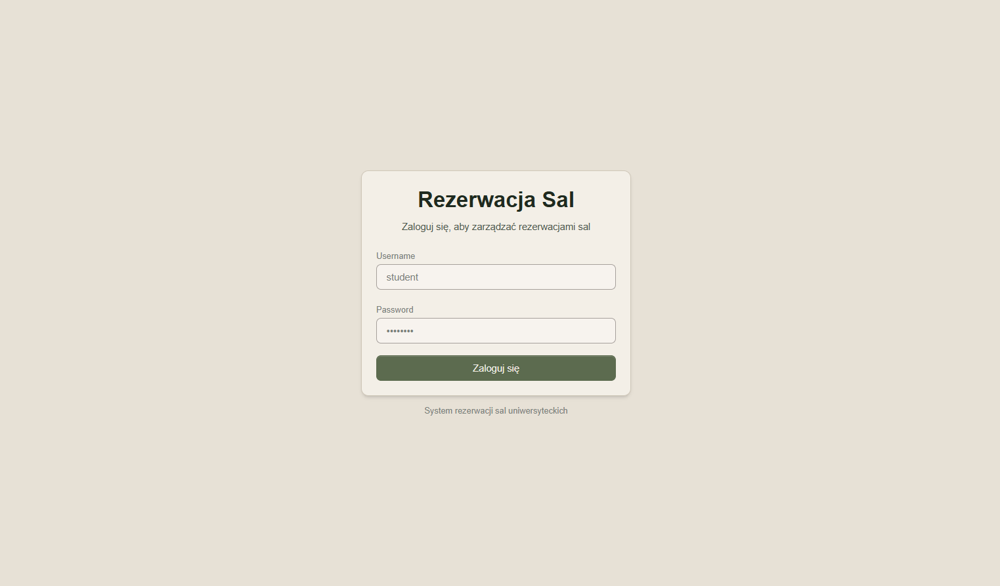
*Strona logowania*

**`/`** — panel główny aplikacji zawierający skróty do najważniejszych funkcjonalności systemu, takich jak zarządzanie salami, rezerwacjami oraz profilem użytkownika. Dla użytkowników posiadających rolę ADMIN dostępna jest dodatkowo sekcja administracyjna.

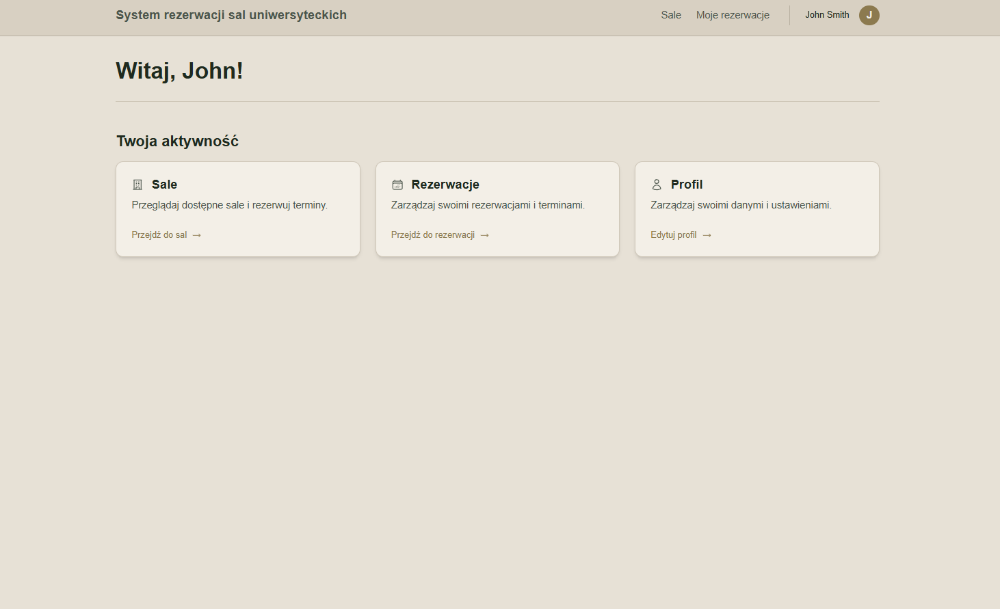
*Ekran główny standardowego użytkownika*

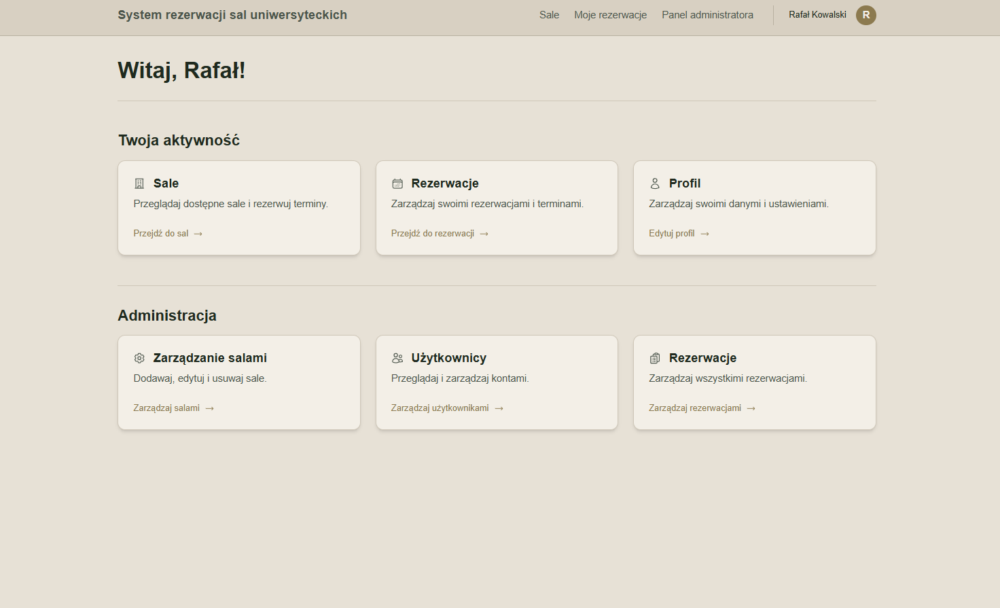
*Ekran główny administratora*

**`/rooms`** — widok prezentujący listę dostępnych sal wraz z możliwością filtrowania wyników według typu sali, budynku oraz minimalnej pojemności. Dostęp do widoku mają wszyscy uwierzytelnieni użytkownicy.

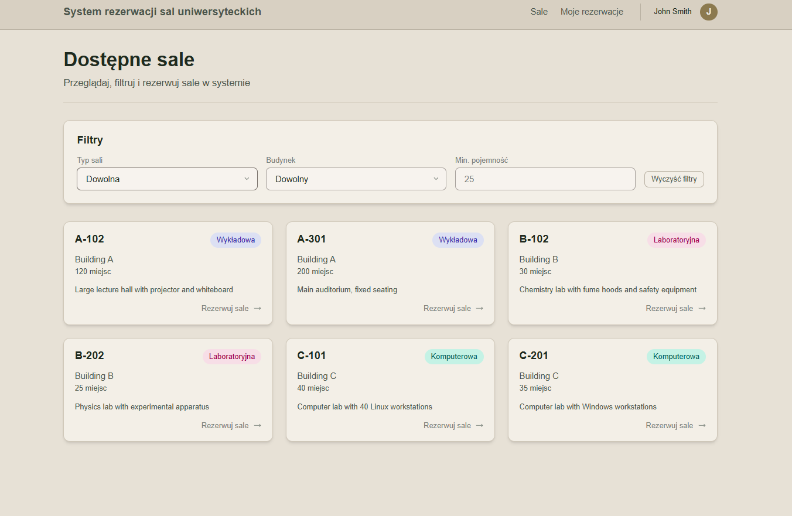
*Widok dostępnych sal*

**`/rooms/[id]`** — szczegółowy widok wybranej sali, umożliwiający przegląd jej parametrów, sprawdzenie dostępności w określonym terminie oraz utworzenie rezerwacji. Użytkownicy z rolą STUDENT nie mogą rezerwować sal wykładowych ani laboratoryjnych. System egzekwuje limity czasu trwania pojedynczej rezerwacji oraz maksymalnej liczby rezerwacji w tygodniu, zależne od roli użytkownika (STUDENT: maks. 2 godziny i 5 rezerwacji tygodniowo, PROWADZĄCY: maks. 4 godziny i 10 rezerwacji tygodniowo, ADMIN: bez ograniczeń). Możliwość rezerwacji tylko przyszłych terminów w slotach czasowych o określonych długościach.

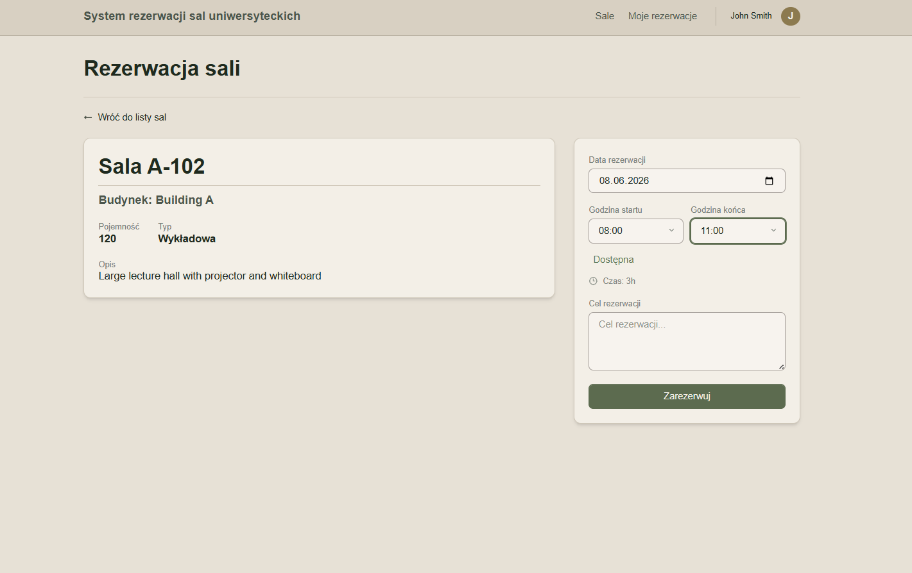
*Widok rezerwacji wybranej sali*

**`/reservations`** — widok prezentujący rezerwacje użytkownika z podziałem na aktywne, zakończone oraz anulowane. Umożliwia anulowanie aktywnych rezerwacji. Dostępny dla wszystkich zalogowanych użytkowników.

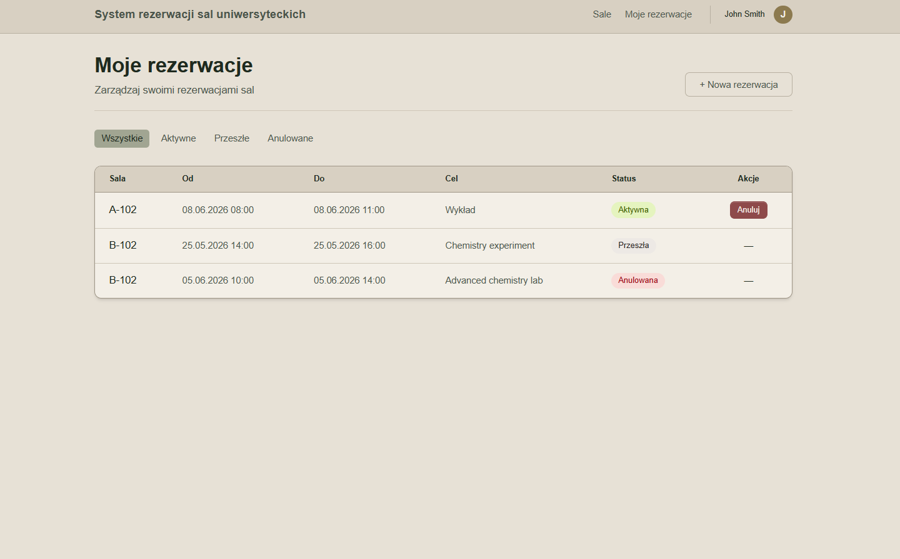
*Widok swoich rezerwacji*

**`/reservations/[id]`** — szczegółowy widok pojedynczej rezerwacji zawierający informacje o terminie, sali oraz celu rezerwacji. Użytkownik standardowy ma dostęp wyłącznie do własnych rezerwacji, natomiast administrator może przeglądać wszystkie wpisy wraz z danymi osoby rezerwującej. Anulowanie jest możliwe wyłącznie dla rezerwacji o statusie aktywnym.

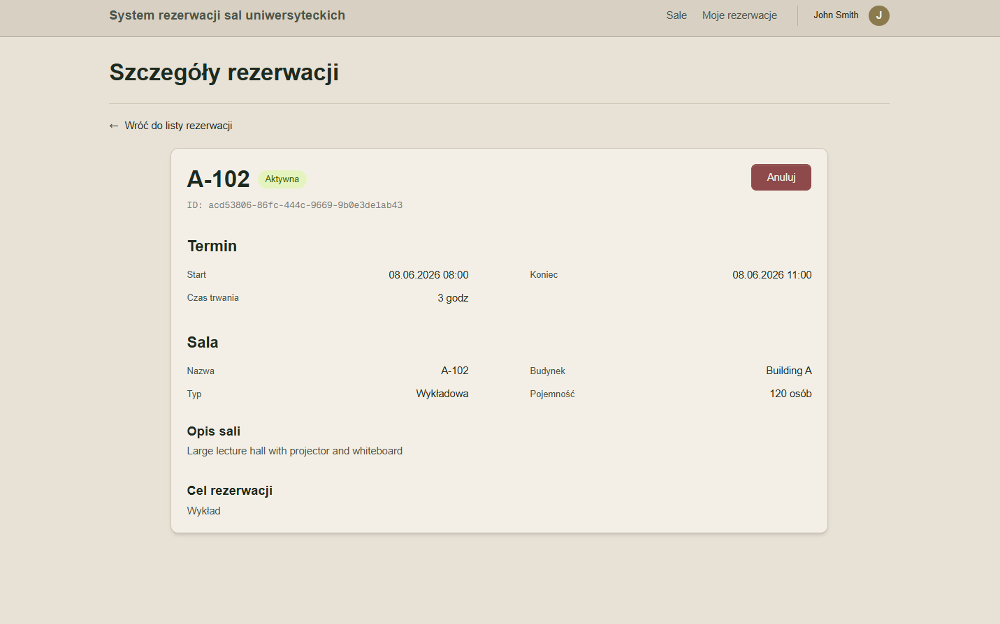
*Widok szczegółów rezerwacji*

**`/users/me`** — widok profilu użytkownika umożliwiający podgląd podstawowych informacji o koncie (login, rola) oraz edycję danych osobowych, takich jak imię, nazwisko i adres e-mail.

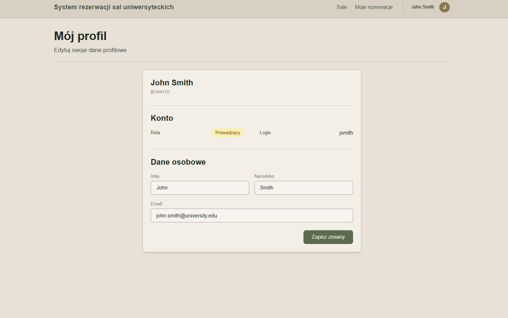
*Profil użytkownika*

**`/admin/rooms`** — panel administracyjny służący do zarządzania salami. Umożliwia dodawanie, edycję oraz usuwanie sal. Dostęp do widoku posiadają wyłącznie użytkownicy z rolą ADMIN. Pozostali użytkownicy są przekierowywani do panelu głównego.

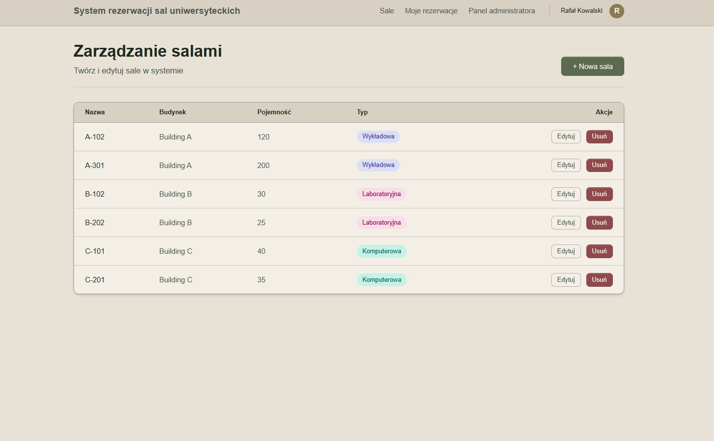
*Panel administracyjny do zarządzania salami*

**`/admin/users`** — panel administracyjny prezentujący listę wszystkich kont użytkowników wraz z przypisanymi rolami. Widok umożliwia sortowanie danych według imienia lub roli, jednak nie udostępnia funkcji edycji kont. Dostęp ograniczony do roli ADMIN.

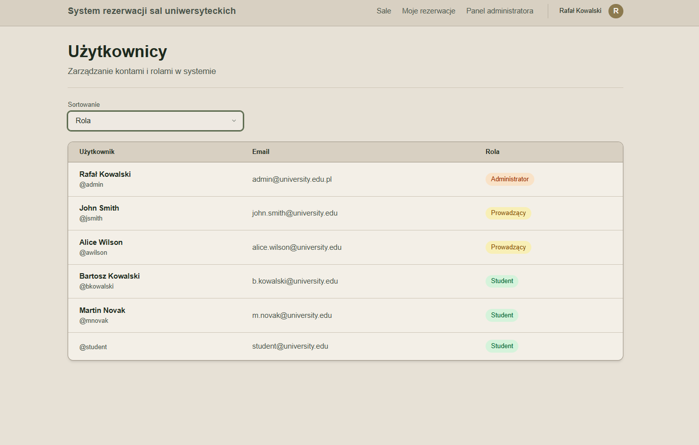
*Panel administracyjny do przeglądania wszystkich użytkowników*

**`/admin/reservations`** — panel administracyjny umożliwiający przegląd wszystkich rezerwacji oraz blokad administracyjnych w systemie. Widok wspiera filtrowanie danych według statusu i typu wpisu, usuwanie aktywnych rezerwacji oraz tworzenie nowych blokad terminów. Dostęp wyłącznie dla użytkowników z rolą ADMIN.

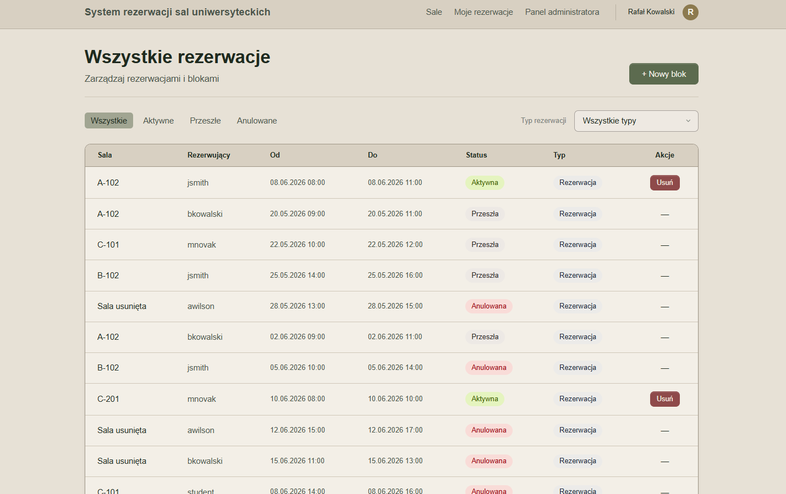
*Panel administracyjny do zarządzania rezerwacjami*

---

## 6. Testy

### 6.1. Zakres testów

Najbardziej rozwinięta warstwa testowa dotyczy backendu. Projekt zawiera:

- **testy jednostkowe** serwisów z użyciem Mockito,
- **testy integracyjne** kontrolerów i logiki systemowej,
- testy bezpieczeństwa i ograniczeń dostępu,
- testy walidacji danych wejściowych,
- testy kolizji rezerwacji i blokad administracyjnych.

### 6.2. Testy jednostkowe

Testy jednostkowe wykorzystują:

- **JUnit 5**,
- **Mockito**,
- klasy zagnieżdżone `@Nested`,
- opisy scenariuszy przez `@DisplayName`.

Pozwala to testować pojedyncze reguły biznesowe bez uruchamiania całego kontekstu aplikacji.

### 6.3. Testy integracyjne

Testy integracyjne korzystają z:

- **Spring Boot Test**,
- **MockMvc** do wykonywania żądań HTTP,
- **Testcontainers** do uruchamiania bazy MySQL w kontenerze,
- wspólnej klasy bazowej `BaseIntegrationTest`.

Takie podejście pozwala weryfikować aplikację w warunkach zbliżonych do rzeczywistego środowiska działania.

### 6.4. Co jest sprawdzane

Zestaw testów obejmuje m.in.:

- poprawne logowanie,
- dostęp do endpointów zależnie od roli,
- maskowanie danych rezerwującego dla nieuprzywilejowanych użytkowników,
- poprawność walidacji DTO,
- obsługę błędów i odpowiednie kody HTTP,
- reguły biznesowe dotyczące limitów rezerwacji,
- blokady administracyjne,
- poprawność filtrowania i pobierania danych.

### 6.5. Pokrycie kodu

W projekcie skonfigurowano **JaCoCo**, które generuje raport pokrycia po uruchomieniu testów. Jest to przydatne narzędzie do oceny jakości warstwy backendowej i stopnia zabezpieczenia logiki biznesowej testami.

---

## 7. Instrukcja uruchomienia

### Wymagania

- **Docker**
- **Java 21+**
- **Node.js**
- **pnpm**

### 1. Uruchom bazę danych

```bash
docker run --name room-reservation-db -e MYSQL_ROOT_PASSWORD=root -e MYSQL_DATABASE=room_reservation -p 3306:3306 -d mysql:8
```

### 2. Utwórz plik `.env` w katalogu głównym

Minimalna konfiguracja:

```properties
DB_URL=jdbc:mysql://localhost:3306/room_reservation
DB_USERNAME=root
DB_PASSWORD=root
JWT_SECRET=twoj-sekretny-klucz-o-dlugosci-minimum-32-znakow
```

### 3. Uruchom backend

```bash
.\mvnw spring-boot:run
```

Backend startuje pod adresem **http://localhost:8080**. Podczas startu Flyway automatycznie wykona migracje bazy danych.

### 4. Uruchom frontend

W osobnym terminalu:

```bash
cd frontend
pnpm i
pnpm dev
```

Frontend działa pod adresem **http://localhost:4000**. Podczas uruchomienia generowane są także typy API na podstawie dokumentacji OpenAPI z backendu, dlatego backend powinien być już uruchomiony.

### 5. Dokumentacja API

Swagger UI jest dostępny pod adresem:

**http://localhost:8080/swagger-ui/index.html**

---

### 8. Podział pracy

| Osoba | Rola |
|-------|------|
| Krzysztof Czerenko | backend, baza danych |
| Magdalena Bernat | frontend |
| Wiktoria Awramik | testy, raport Jacoco |

---

## 8. Podsumowanie

Projekt realizuje kompletny system rezerwacji sal uczelnianych z podziałem na backend, frontend i warstwę testową. Zastosowane rozwiązania - takie jak architektura warstwowa, JWT, DTO, Specification Pattern, Testcontainers i własny design system - pokazują praktyczne wykorzystanie współczesnych narzędzi i wzorców stosowanych w aplikacjach webowych.