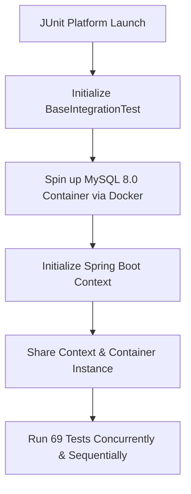

# Testing Architecture & Environment Documentation

This document describes the design, architecture, and implementation of the automated test suite guarding the University Room Reservation System.

---

## 1. Introduction & Key Statistics

The application is guarded by a comprehensive automated test suite consisting of **69 tests**, combining fast Mockito unit tests and containerized integration tests using Testcontainers. 

### Key Metrics:
* **Total Automated Tests**: 69
* **Pass Rate**: 100%
* **Operational Business Logic Coverage (Services & Controllers)**: Near 100%

> [!NOTE]
> **Architectural Note on JaCoCo Coverage Boundaries:**
> Domain models (JPA entities), DTO records, custom exceptions, and basic configuration packages are intentionally excluded from strict JaCoCo coverage requirements. These components consist of standard Java/Spring boilerplate code (getters, setters, constructors, structure declarations) with no custom business logic. Coverage is strictly focused on active operational layers (controllers, services, repositories, security logic).

---

## 2. JUnit 5 Architecture & Language Decision

The test suite uses **JUnit 5** to organize tests cleanly and readably.

### `@Nested` Structural Layout
Test classes are organized into logical business processes using non-static `@Nested` inner classes. This groups tests by domain behavior rather than technical mapping:
* `TworzenieRezerwacji` (Reservation Creation flow)
* `AnulowanieRezerwacji` (Cancellation operations)
* `BlokadyAdministracyjne` (Admin room blocking controls)
* `ListowanieISzczegoly` (Listings and data retrieval)
* `SprawdzanieDostepnosci` (Room availability checks)

### Architectural Language Decision (Ubiquitous Language)
While all technical code, Java class definitions, variable names, and method names are preserved in **English**, the `@DisplayName` annotations and business test scenarios are written in **Polish**. 

This is a deliberate design decision based on **Domain-Driven Design (DDD) Ubiquitous Language** principles:
1. **Frontend & UI Alignment**: The system's user interface is targeted at Polish universities and uses local terminology.
2. **Regulatory & Administrative Requirements**: The booking rules, weekly limits, and educational roles directly map to Polish university regulations.
3. **Data Privacy (GDPR/RODO)**: Privacy policies, access controls, and data masking procedures are defined in Polish regulatory terms. Keeping display names in Polish ensures that business developers, product owners, and QA engineers share a common terminology.

---

## 3. Integration Environment (Testcontainers)

To verify the database layer and transaction controls, the integration suite uses **Testcontainers** to spin up a fully isolated **MySQL 8.0** database container inside Docker.



### Singleton Pattern Optimization
Starting a Docker container for each test class would introduce significant execution overhead. To prevent this, the `BaseIntegrationTest` class implements a **Singleton container pattern**:
* A static `MySQLContainer` instance is declared and started inside a static initialization block.
* All integration test classes (`ReservationControllerIntegrationTest`, `RoomControllerIntegrationTest`, `UserControllerIntegrationTest`, `AuthControllerIntegrationTest`, `ReservationServiceIntegrationTest`) inherit from `BaseIntegrationTest`.
* By sharing a single database container instance across all tests in the JVM run, container initialization happens exactly **once**, optimizing overall test suite execution.

---

## 4. Concurrency & Race Conditions Defense

To prevent double-booking conflicts in a highly concurrent environment, a specialized concurrency integration test was implemented:
* **Implementation**: The test uses `ExecutorService` with a fixed pool of **10 threads** and a `CountDownLatch` to release all threads simultaneously.
* **Scenario**: 10 different students attempt to reserve the exact same room for the exact same time slot concurrently.
* **Defense Mechanism**: The test validates that exactly **one** reservation succeeds, while the other **9** requests are safely rejected with a `ReservationConflictException`.

### Pessimistic Locking
To pass this concurrency gate, database-level write locking was implemented in `RoomRepository.java` using JPA's pessimistic write lock:
```java
@Lock(LockModeType.PESSIMISTIC_WRITE)
@Query("SELECT r FROM Room r WHERE r.id = :id")
Optional<Room> findWithLockById(@Param("id") UUID id);
```
This forces concurrent booking requests to wait for the active transaction to release the room lock, avoiding dirty reads and double bookings.

---

## 5. Security Matrix & Data Privacy (RODO/GDPR)

The system enforces strict access control policies using Spring Security. The test suite verifies these rules using `MockMvc` and JWT Bearer tokens injected into HTTP requests.

### Role-Based Access Control (RBAC) Matrix:
| Endpoint | Method | ROLE_ADMIN | ROLE_LECTURER | ROLE_STUDENT |
| :--- | :--- | :---: | :---: | :---: |
| `/auth/login` | `POST` | Permitted | Permitted | Permitted |
| `/rooms` | `POST` | **Allowed (201)** | Forbidden (403) | Forbidden (403) |
| `/rooms/{id}` | `PATCH` | **Allowed (200)** | Forbidden (403) | Forbidden (403) |
| `/rooms/{id}` | `DELETE` | **Allowed (204)** | Forbidden (403) | Forbidden (403) |
| `/reservations/blocks` | `POST`/`DELETE` | **Allowed** | Forbidden (403) | Forbidden (403) |
| `/users` | `GET` | **Allowed (200)** | Forbidden (403) | Forbidden (403) |
| `/users/{id}` | `GET` | **Allowed (200)** | Forbidden (403) | Forbidden (403) |

### RODO/GDPR Data Privacy Masking
* **Scenario**: When a user with `ROLE_STUDENT` or `ROLE_LECTURER` fetches the list of reservations, the backend must not leak the identity of other bookers.
* **Test Verification**: The test suite verifies that when a non-admin retrieves the reservation lists (`GET /reservations`), the `bookerName` field is automatically masked (omitted or null in the JSON response). Only `ROLE_ADMIN` users can view the raw booker names.

---

## 6. DTO Boundary Validations & Exception Handling

Input constraints are enforced using Jakarta Validation annotations on DTOs, including `@Valid`, `@NotBlank`, `@Min`, and `@Email`.

### Boundary Test Coverage
* **Missing Fields**: Requests missing required properties (such as null start times or empty room IDs) return HTTP 400 Bad Request.
* **Capacity Constraints**: Room requests with capacity values less than 1 (e.g. `capacity: -5`) are rejected.
* **Email Constraints**: Profile updates with invalid email formats (e.g., `invalid_email_no_at`) are rejected.

### Exception Translation
All validation errors are caught by `GlobalExceptionHandler.java`, which translates internal validation exceptions into a clean JSON response payload returning an HTTP 400 Bad Request status:
```json
{
  "status": 400,
  "error": "Detailed validation error messages"
}
```

---

## 7. Execution Guide

To build the project and execute all unit and integration tests locally, run the following command in the root directory:

```bash
# Windows
.\mvnw clean test

# Linux / macOS
./mvnw clean test
```

### Coverage Reports
The test execution automatically generates a JaCoCo code coverage report. Once the test run completes successfully, you can view the HTML report by opening:
`target/site/jacoco/index.html`
