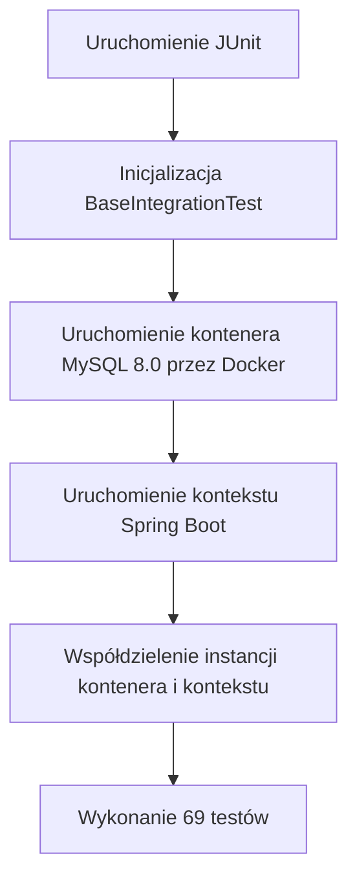

# Dokumentacja architektury i środowiska testowego

Ten dokument opisuje projekt, architekturę oraz implementację zautomatyzowanego zestawu testów zabezpieczającego system rezerwacji sal uniwersyteckich.

---

## 1. Wstęp i kluczowe statystyki

Aplikacja jest zabezpieczona kompletnym zestawem **69 testów**, łączącym szybkie testy jednostkowe Mockito oraz kontenerowe testy integracyjne przy użyciu Testcontainers.

### Kluczowe metryki:
* **Liczba zautomatyzowanych testów**: 69
* **Wskaźnik powodzenia (Pass Rate)**: 100%
* **Pokrycie logiki biznesowej (serwisy i kontrolery)**: blisko 100%

> [!NOTE]
> **Uwaga architektoniczna dotycząca granic pokrycia JaCoCo:**
> Modele domenowe (encje JPA), rekordy DTO, własne klasy wyjątków oraz podstawowe pakiety konfiguracyjne są celowo wyłączone z restrykcyjnych reguł pokrycia kodu JaCoCo. Komponenty te składają się z typowego kodu szablonowego Java/Spring (gettery, settery, konstruktory, deklaracje struktur) pozbawionego niestandardowej logiki biznesowej. Testy skupiają się wyłącznie na warstwach operacyjnych (kontrolery, serwisy, repozytoria, logika zabezpieczeń).

---

## 2. Architektura JUnit 5 i język opisów (Ubiquitous Language)

Zestaw testów wykorzystuje możliwości **JUnit 5** w celu zachowania czytelności i odpowiedniej organizacji kodu.

### Struktura klas `@Nested`
Klasy testowe zostały podzielone tematycznie na logiczne procesy biznesowe przy użyciu niestatycznych klas wewnętrznych z adnotacją `@Nested`. Ułatwia to grupowanie testów według zachowań domenowych, a nie mapowania technicznego:
* `TworzenieRezerwacji` (Proces składania rezerwacji)
* `AnulowanieRezerwacji` (Operacje wycofywania rezerwacji)
* `BlokadyAdministracyjne` (Administracyjne wyłączenia sal z użytku)
* `ListowanieISzczegoly` (Listowanie i pobieranie danych)
* `SprawdzanieDostepnosci` (Weryfikacja dostępności sal w czasie)

### Język opisów biznesowych (Język Wszechobecny / Ubiquitous Language)
Podczas gdy kod techniczny, definicje klas Java oraz nazwy metod testowych są pisane w języku **angielskim**, adnotacje `@DisplayName(...)` oraz scenariusze biznesowe zostały celowo napisane w języku **polskim**.

Decyzja ta wynika bezpośrednio z zasad **Domain-Driven Design (DDD)** i koncepcji *Języka Wszechobecnego*:
1. **Spójność z interfejsem (Frontend)**: System rezerwacji sal jest przeznaczony dla polskich uczelni, a jego interfejs i komunikacja z użytkownikiem końcowym odbywają się w języku polskim.
2. **Krajowe wymogi administracyjne**: Limity rezerwacji, statusy sal, role (student, wykładowca) i regulaminy rezerwacji bezpośrednio odzwierciedlają strukturę polskich uczelni.
3. **Ochrona prywatności danych (RODO/GDPR)**: Procedury maskowania danych osobowych i nadawania uprawnień są bezpośrednio zakorzenione w krajowych i europejskich przepisach prawnych, co ułatwia audyt zgodności.

---

## 3. Środowisko integracyjne (Testcontainers)

W celu pełnego przetestowania warstwy bazodanowej oraz kontroli transakcji, zestaw testów integracyjnych wykorzystuje **Testcontainers** do uruchamiania w pełni odizolowanej bazy danych **MySQL 8.0** wewnątrz kontenera Docker.



### Optymalizacja wzorcem Singleton
Uruchamianie osobnego kontenera Docker dla każdej klasy testowej wiązałoby się z ogromnym narzutem czasowym. Aby temu zapobiec, klasa bazowa `BaseIntegrationTest` implementuje **wzorzec Singleton**:
* Statyczna instancja `MySQLContainer` jest deklarowana i uruchamiana wewnątrz statycznego bloku inicjalizacyjnego klasy.
* Wszystkie klasy testów integracyjnych dziedziczą po `BaseIntegrationTest`.
* Dzięki współdzieleniu jednej instancji kontenera bazy danych w ramach jednego uruchomienia maszyny wirtualnej JVM, inicjalizacja bazy odbywa się dokładnie **raz**, co drastycznie skraca czas wykonywania testów.

---

## 4. Obrona przed współbieżnością i zakleszczeniami

Aby zapobiec konfliktom podwójnej rezerwacji w środowisku wielodostępowym, wdrożono specjalistyczny integracyjny test współbieżności:
* **Implementacja**: Test wykorzystuje `ExecutorService` z pulą **10 wątków** oraz obiekt synchronizujący `CountDownLatch` w celu jednoczesnego zwolnienia wszystkich wątków.
* **Scenariusz**: 10 różnych studentów próbuje zarezerwować dokładnie tę samą salę na ten sam przedział czasowy w tym samym momencie.
* **Mechanizm obronny**: Test weryfikuje, że dokładnie **jedna** rezerwacja kończy się sukcesem (zapis w bazie danych), podczas gdy pozostałe **9** żądań zostaje bezpiecznie odrzuconych z wyjątkiem `ReservationConflictException`.

### Blokowanie Pesymistyczne (Pessimistic Locking)
Aby sprostać wymaganiom współbieżności, na poziomie repozytorium (`RoomRepository.java`) wdrożono mechanizm blokowania pesymistycznego zapisu na bazie danych:
```java
@Lock(LockModeType.PESSIMISTIC_WRITE)
@Query("SELECT r FROM Room r WHERE r.id = :id")
Optional<Room> findWithLockById(@Param("id") UUID id);
```
Dzięki temu współbieżne żądania rezerwacji muszą czekać na zakończenie i zatwierdzenie transakcji blokującej pokój, co eliminuje problem zjawiska wyścigu (race condition).

---

## 5. Macierz uprawnień i ochrona prywatności danych (RODO/GDPR)

System wymusza restrykcyjną kontrolę dostępu przy użyciu modułu Spring Security. Prawidłowość reguł bezpieczeństwa jest weryfikowana za pomocą narzędzia `MockMvc` oraz dynamicznie wstrzykiwanych tokenów JWT.

### Macierz uprawnień (RBAC):
| Endpoint | Metoda | ROLE_ADMIN | ROLE_LECTURER | ROLE_STUDENT |
| :--- | :--- | :---: | :---: | :---: |
| `/auth/login` | `POST` | Zezwolono | Zezwolono | Zezwolono |
| `/rooms` | `POST` | **Zezwolono (201)** | Zabroniono (403) | Zabroniono (403) |
| `/rooms/{id}` | `PATCH` | **Zezwolono (200)** | Zabroniono (403) | Zabroniono (403) |
| `/rooms/{id}` | `DELETE` | **Zezwolono (204)** | Zabroniono (403) | Zabroniono (403) |
| `/reservations/blocks` | `POST`/`DELETE` | **Zezwolono** | Zabroniono (403) | Zabroniono (403) |
| `/users` | `GET` | **Zezwolono (200)** | Zabroniono (403) | Zabroniono (403) |
| `/users/{id}` | `GET` | **Zezwolono (200)** | Zabroniono (403) | Zabroniono (403) |

### Anonimizacja i ochrona danych osobowych (RODO/GDPR)
* **Scenariusz**: Podczas pobierania listy rezerwacji przez użytkowników o rolach studenta lub wykładowcy, system nie może ujawniać danych osobowych innych rezerwujących.
* **Weryfikacja testowa**: Zestaw testów weryfikuje, że w zapytaniu `/reservations` wykonywanym przez użytkownika bez roli administratora, pole `bookerName` jest automatycznie maskowane (nie występuje w odpowiedzi JSON). Jedynie administratorzy mają wgląd w pełne nazwy użytkowników składających rezerwacje.

---

## 6. Walidacja brzegowa DTO i obsługa wyjątków

Poprawność i kompletność danych wejściowych jest wymuszana przez adnotacje walidacyjne biblioteki Jakarta Validation umieszczone w strukturach DTO, takie jak `@Valid`, `@NotBlank`, `@Min`, czy `@Email`.

### Pokrycie testów walidacyjnych
* **Brakujące pola**: Żądania z wartościami null dla wymaganych pól (np. brak ID sali lub dat) zwracają status HTTP 400 Bad Request.
* **Ograniczenia pojemności**: Tworzenie lub aktualizacja sal z pojemnością mniejszą niż 1 (np. `capacity: -5`) kończy się odrzuceniem żądania.
* **Formaty adresów e-mail**: Aktualizacja profilu z błędnym formatem adresu e-mail (np. brak znaku `@`) jest blokowana na poziomie walidacji wejściowej.

### Obsługa i mapowanie wyjątków
Wszystkie błędy walidacji są przechwytywane przez klasę `GlobalExceptionHandler.java`, która tłumaczy je na czytelny format odpowiedzi JSON o statusie HTTP 400 Bad Request:
```json
{
  "status": 400,
  "error": "Szczegółowy komunikat o błędach walidacji pól"
}
```

---

## 7. Instrukcja uruchomienia

Aby zbudować projekt i uruchomić pełny zestaw testów lokalnie, wykonaj następujące polecenie w katalogu głównym projektu:

```bash
# Systemy Windows
.\mvnw clean test

# Systemy Linux / macOS
./mvnw clean test
```

### Raporty pokrycia kodu
Wykonanie testów automatycznie generuje raport pokrycia kodu JaCoCo. Po pomyślnym zakończeniu testów, raport w formacie HTML można otworzyć w przeglądarce pod adresem:
`target/site/jacoco/index.html`
